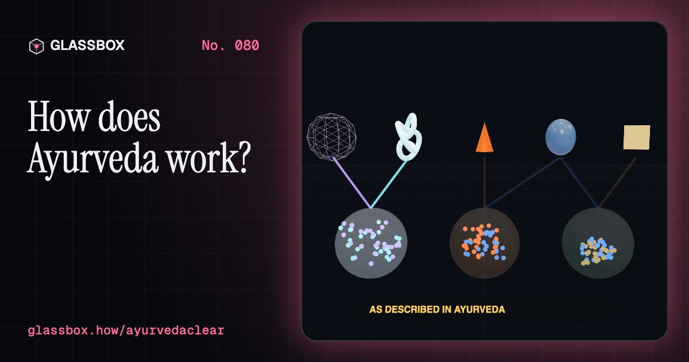
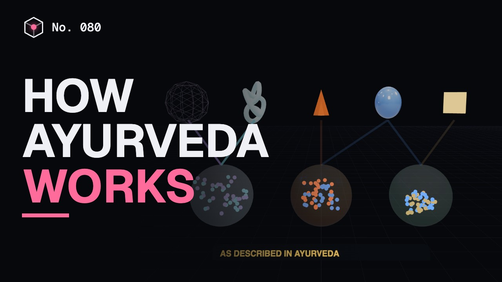
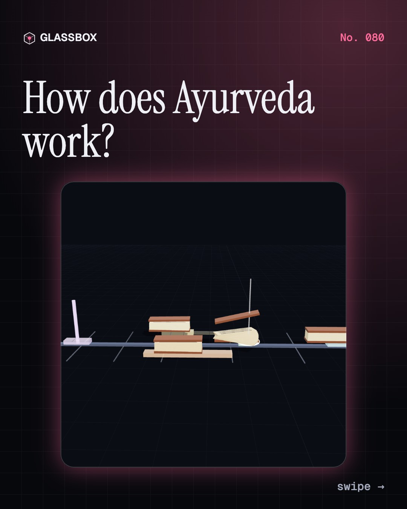
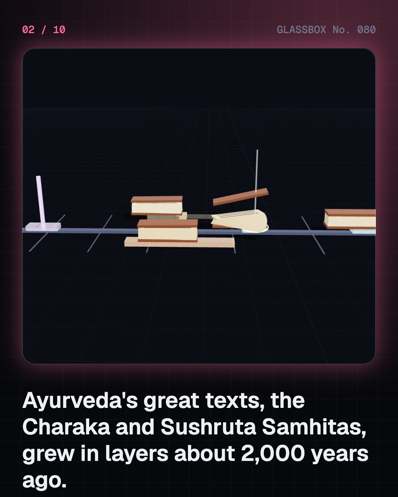
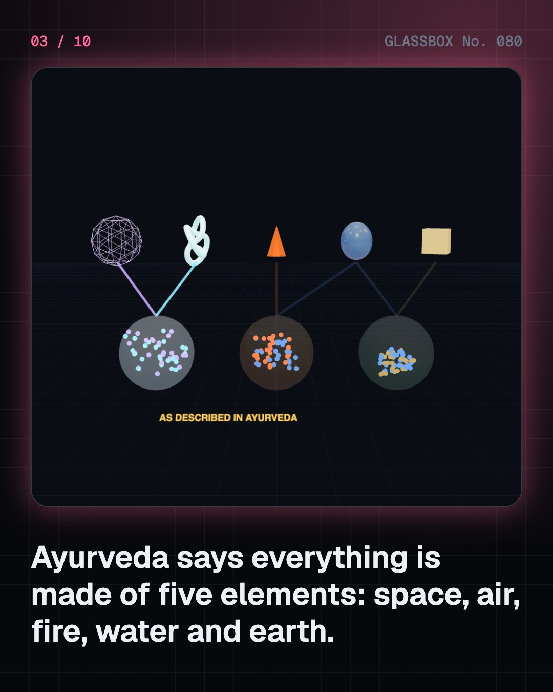
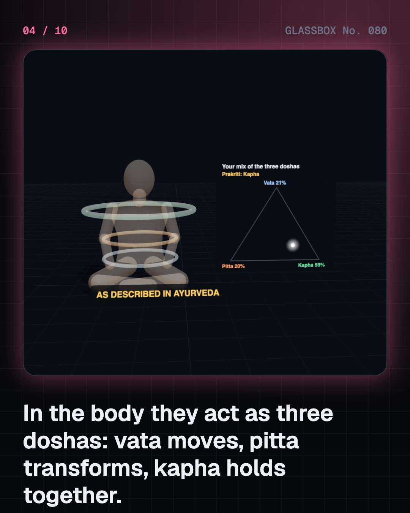

<!-- glassbox:start -->
<!-- Generated from glassbox.json by the Glassbox hub (npm run readme -- ayurvedaclear). Edit glassbox.json, not this block. -->
<p align="center"><a href="https://glassbox.how/e/ayurvedaclear/"></a></p>

<h1 align="center">AyurvedaClear</h1>

<p align="center"><b>How does Ayurveda work?</b><br>Half of India used an AYUSH system last year, and Ayurveda most of all. Build the five elements into vata, pitta and kapha, boil a kwatha down to a quarter, follow sarpagandha root into a blood-pressure pill, then run a fair trial and see how bias fools us.</p>

<p align="center"><a href="https://glassbox.how/ayurvedaclear/"><b>▶ Play with it</b></a> &nbsp;·&nbsp; <a href="https://glassbox.how/e/ayurvedaclear/">Read the 60-second explainer</a> &nbsp;·&nbsp; <a href="https://glassbox.how/ayurvedaclear/glassbox/reel.mp4">Watch the 40-second video</a></p>

<p align="center">
  <a href="https://glassbox.how/e/ayurvedaclear/"></a>
  <a href="https://glassbox.how/e/ayurvedaclear/"></a>
  <a href="LICENSE"></a>
  <a href="LICENSE-CONTENT.md"></a>
  <a href="#privacy"></a>
</p>

## In 60 seconds

1. **Three old books and a living system.** Ayurveda, "knowledge of life", was written down in the Charaka and Sushruta Samhitas and Vagbhata's Ashtanga Hridaya, texts that grew in layers roughly 2,000 years ago. It has eight classical branches, and today a Ministry of AYUSH, a regulator (NCISM), a research council (CCRAS) and a 5½-year BAMS degree.
2. **Five elements, three doshas.** As Ayurveda describes it, space, air, fire, water and earth work in the body as three doshas: vata moves, pitta transforms, kapha holds together. Each person's inborn mix is their prakriti; digestive fire (agni) feeds seven tissues in turn, and weak agni leaves sticky ama. These are the system's own concepts, not anatomy.
3. **Pulse, pot and routine.** A vaidya asks, looks and may read the pulse with three fingers, a method first written down around the 13th century. Treatment starts with diet and daily and seasonal routine, then herbal medicines such as triphala or a kwatha: one part herb boiled in 16 parts water down to a quarter. Panchakarma is a supervised cleansing course.
4. **From a snakeroot to a blood-pressure pill.** In 1931 the Kolkata kaviraj Gananath Sen reported that sarpagandha root lowered blood pressure; in 1949 R. J. Vakil tested it in Mumbai; in 1952 pure reserpine was isolated and became a drug. Pure compounds give exact doses, while root reserpine varies about fourfold. Curcumin and ashwagandha evidence is mixed or emerging.
5. **A fair test, and a safety check.** Many people improve anyway, so fair trials randomise, blind and compare with a placebo. Reviews find most Ayurveda trials small or weak, with a few encouraging ones. US tests found lead, mercury or arsenic in about 1 in 5 products, and 4 in 10 metal-based ones; India licenses products and tests exports for metals.
6. **Using it wisely.** Regular sleep, fresh plant-rich food, not overeating and daily exercise match modern advice. Never stop a prescribed medicine, tell every doctor what you take, and see a qualified doctor for serious illness. Supporters and critics of integrative medicine agree that fair tests should decide what works.

## Words worth knowing

| Term | Meaning |
|---|---|
| **Ayurveda** | India's classical system of medicine, "knowledge of life", set out in Sanskrit texts. |
| **Dosha** | One of three functional principles, vata, pitta and kapha, whose balance Ayurveda equates with health. |
| **Prakriti** | A person's inborn constitution: their own mix of the three doshas. |
| **Agni** | The "digestive fire" that, in Ayurveda, turns food into nourishment for the tissues. |
| **Kwatha** | A decoction: herbs boiled in water and reduced, usually to a quarter. |
| **Rasa shastra** | Ayurvedic pharmacy that processes metals and minerals into medicines. |
| **Reserpine** | A blood-pressure drug isolated in 1952 from the Ayurvedic plant sarpagandha. |
| **Placebo** | A dummy treatment used in fair trials to show what the real treatment adds. |
| **Randomised blinded trial** | A test where chance decides who gets what and nobody knows, so bias can't creep in. |

## A short history

**About 3,000 years from healing hymns and palm-leaf texts to a ministry, a WHO centre and fair trials.**

- **1100 BCE** · Healing hymns of the Atharvaveda (Vedic poets, North-west India)
- **100 BCE** · The Charaka Samhita (Attributed to Charaka, after Agnivesha; completed by Dridhabala, North-west India)
- **0** · The Sushruta Samhita and early surgery (Attributed to Sushruta, Varanasi (by tradition))
- **600** · Vagbhata’s Ashtanga Hridaya (Vagbhata, Sindh (by tradition))
- **1678** · Kerala physicians behind Hortus Malabaricus (Itty Achuden, with Hendrik van Rheede, Kochi, printed in Amsterdam)
- **1835** · Colonial rule closes the Ayurveda classes (Government of Bengal (Bentinck), Calcutta (Kolkata))
- **1949** · Vakil’s trial in Mumbai (Rustom Jal Vakil, Mumbai)
- **1952** · Reserpine is isolated (Johannes Müller, Emil Schlittler and Hugo Bein, Ciba, Basel)

The full story, with 29 moments, charts, people and 40 sources: [glassbox.how/e/ayurvedaclear/history](https://glassbox.how/e/ayurvedaclear/history/). The data lives in [`history.json`](history.json).

## Video and slides

Made with the Glassbox studio from this box's storyboard (`window.glassbox.director`). Free to reuse under CC BY 4.0.

<a href="https://glassbox.how/ayurvedaclear/glassbox/video.mp4"></a>

<p><a href="glassbox/slide-1.jpg"></a> <a href="glassbox/slide-2.jpg"></a> <a href="glassbox/slide-3.jpg"></a> <a href="glassbox/slide-4.jpg"></a></p>

| File | What | Size |
|---|---|---|
| [`glassbox/reel.mp4`](https://glassbox.how/ayurvedaclear/glassbox/reel.mp4) | Reel / Short, with captions and soundtrack | 1080×1920 |
| [`glassbox/video.mp4`](https://glassbox.how/ayurvedaclear/glassbox/video.mp4) | YouTube video, with captions and soundtrack | 1920×1080 |
| `glassbox/slide-1…10.jpg` | Instagram carousel | 1080×1350 |
| `glassbox/thumb.jpg` | YouTube thumbnail | 1280×720 |
| `glassbox/cover.jpg` | Share card and repo social preview | 1200×630 |
| [`glassbox/history-reel.mp4`](https://glassbox.how/ayurvedaclear/glassbox/history-reel.mp4) | “History in 10 moments” Reel / Short | 1080×1920 |
| `glassbox/history-slide-*.jpg` | History carousel | 1080×1350 |
| `glassbox/post.json` | Post copy and schedule used by the publish kit | |

## Privacy

This box has no accounts and no ads, and it ships its own fonts and libraries. When you run it yourself it sends nothing anywhere. On glassbox.how, the site's `/bar.js` also loads Glassbox's analytics: **Google Analytics** to count visits (it asks first in the EU, UK and Switzerland, and stays off when your browser sends Global Privacy Control or Do Not Track) and **ClickTrust** to detect bots.

It remembers a few things **in your own browser only**, and never sends them anywhere:

| Browser storage key | What it holds |
|---|---|
| `ayurvedaclear.v1` | Which chapters you have opened, your best quiz scores, and sound on or off. |

Exactly what each one sees is at [glassbox.how/privacy](https://glassbox.how/privacy/).

## Licences

- **Code:** [MIT](LICENSE). Use it, change it, ship it.
- **Explanations, text, images and videos** (`glassbox.json`, `glassbox/`): [CC BY 4.0](LICENSE-CONTENT.md). Credit “Glassbox, glassbox.how/e/ayurvedaclear”.
- **Third-party parts** keep their own licences: [three.js](https://threejs.org) (MIT), [Geist, Instrument Serif](https://openfontlicense.org) (SIL OFL 1.1).
- The Glassbox name and logo aren't covered by either licence. See the [terms](https://glassbox.how/terms/).

Found a mistake? [Open an issue](https://github.com/bdeeps/ayurvedaclear/issues). Corrections happen in public.
<!-- glassbox:end -->

## Run it

It's plain HTML, CSS and JavaScript. No build step and no dependencies. Run locally, it contacts no other website.

```bash
python3 -m http.server 8000
```

Three.js and the fonts ship in `vendor/` and `fonts/`, so it also works offline.

Then open http://localhost:8000.

## How it's built

| File | What |
|---|---|
| `index.html`, `css/app.css` | The page and its styles |
| `js/app.js`, `js/stage.js`, `js/ui.js`, `js/kit.js` | The shared Glassbox 3D engine: chapters, 3D stage, controls, quiz, video director |
| `js/chapters/*.js` | One file per chapter: the 3D model, controls, text, key terms, quiz and video scenes |
| `js/ayur.js` | AyurvedaClear's shared pieces: the five elements, three doshas, seven dhatus and four states of agni as the classical texts define them, palm-leaf manuscripts, plants, flame, figures, boards and label helpers |
| `glassbox.json` | Title, question, explainer beats, key terms, browser storage and credits shown on glassbox.how |
| `reel` in each chapter | The storyboard the Glassbox studio records into short videos |
| `glassbox/` | The published video, slides, thumbnail and post copy |
| `fonts/`, `vendor/three/` | Self-hosted Geist and Instrument Serif (SIL OFL 1.1) and three.js (MIT) |
